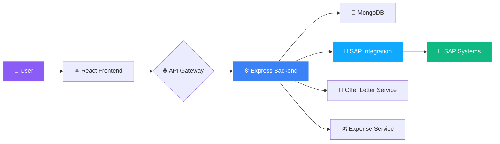

<!-- ═══════════════════════════════════════════════════════════════ -->
<!-- 🏢 Enterprise Portal — Premium Animated README -->
<!-- ═══════════════════════════════════════════════════════════════ -->

<div align="center">


</div>

<div align="center">
  
</div>

<br/>

<div align="center">
  <a href="https://github.com/sumit966/YOUR-REPO-NAME/stargazers">
    
  </a>
  <a href="https://github.com/sumit966/YOUR-REPO-NAME/network/members">
    
  </a>
  <a href="https://github.com/sumit966/YOUR-REPO-NAME/issues">
    
  </a>
  <a href="https://github.com/sumit966/YOUR-REPO-NAME/commits/main">
    
  </a>
</div>

<br/>

<div align="center">
  
  
  
</div>

<br/>

<div align="center">
  
  
  
  
  
  
</div>

<br/>

<div align="center">
  <i>🏢 Enterprise Operations Platform · Built by <b>Sumit Raj</b></i>
</div>

<br/>


---

## 🎯 Overview


An **enterprise-grade operations platform** that streamlines HR, finance, and SAP-integrated business workflows. Built with a **modern full-stack architecture** — React frontend + Node.js/Express backend + SAP integration layer.

> **🎯 Purpose:** Replace fragmented business tools with a **single unified portal** for offer letters, expense tracking, budget management, and SAP data sync.

<br clear="right"/>

<table>
<tr>
<td width="50%" valign="top">

### 🎯 The Problem

- 📄 HR teams manually generate offer letters (slow, error-prone)
- 💰 No centralized expense tracking → budget overruns
- 🔗 SAP data lives in silos → manual reconciliation
- 📊 No unified dashboard for management
- 🗂️ Fragmented tools → poor visibility

</td>
<td width="50%" valign="top">

### ✨ The Solution

- 🚀 **Automated offer letter generation** in seconds
- 💰 **Real-time expense & budget tracking** with alerts
- 🔗 **SAP-integrated data** sync with fallback handling
- 📊 **Unified dashboard** for all business operations
- 🏢 **Enterprise-ready** with proper error handling

</td>
</tr>
</table>

---

## ✨ Features

<table>
<tr>
<td width="33%" valign="top" align="center">

### 📄 HR Module


- ✍️ Offer Letter Generator
- 📝 Template Management
- 📤 Auto PDF Export
- 📧 Email Integration
- 📂 Document Archive

</td>
<td width="33%" valign="top" align="center">

### 💰 Finance Module


- 💵 Expense Tracking
- 📊 Budget Management
- 📈 Real-time Analytics
- 🔔 Over-budget Alerts
- 📉 Category-wise Reports

</td>
<td width="33%" valign="top" align="center">

### 🔗 SAP Integration


- 🔄 Data Synchronization
- 🔐 Secure API Bridge
- 🛡️ Fallback Handling
- 📡 Real-time Updates
- 📊 Sync Reports

</td>
</tr>
</table>

<br/>

<table>
<tr>
<td width="50%" valign="top" align="center">

### 🎨 Frontend

- ⚛️ Modern React SPA
- 🎨 Responsive Design
- 🌐 Client-side Routing
- 🔐 Auth Context
- 📱 Mobile-First

</td>
<td width="50%" valign="top" align="center">

### ⚙️ Backend

- 🚀 Node.js + Express
- 🔌 RESTful APIs
- 🗄️ MongoDB Integration
- 🛡️ Security Middleware
- 📊 Modular Routes

</td>
</tr>
</table>

---

## 🏗️ Architecture

### 🔄 System Overview



### 🧩 Tech Stack Layers

```
┌──────────────────────────────────────────────┐
│  🎨 PRESENTATION LAYER                       │
│  React · HTML5 · CSS3 · JavaScript           │
├──────────────────────────────────────────────┤
│  🔌 API LAYER                                │
│  Express · REST · JWT Auth · Middleware      │
├──────────────────────────────────────────────┤
│  🧠 BUSINESS LOGIC                           │
│  Offer Letters · Expenses · Budgets          │
├──────────────────────────────────────────────┤
│  🔗 INTEGRATION LAYER                        │
│  SAP Connector · Fallback · Sync             │
├──────────────────────────────────────────────┤
│  💾 DATA LAYER                               │
│  MongoDB · File Storage                      │
└──────────────────────────────────────────────┘
```

---

## 🛠️ Tech Stack

<table align="center">
<tr>
<td><b>Category</b></td>
<td><b>Technology</b></td>
</tr>
<tr>
<td>🎨 Frontend</td>
<td>
  
  
  
  
</td>
</tr>
<tr>
<td>⚙️ Backend</td>
<td>
  
  
  
</td>
</tr>
<tr>
<td>💾 Database</td>
<td>
  
</td>
</tr>
<tr>
<td>🔗 Integration</td>
<td>
  
  
</td>
</tr>
<tr>
<td>🛡️ Auth & Security</td>
<td>
  
  
</td>
</tr>
</table>

---

## 📁 Project Structure

```
enterprise-portal/
│
├── 🎨 frontend/                        # React Application
│   ├── 📂 public/                      # Static assets
│   ├── 📂 src/
│   │   ├── 🧩 components/              # Reusable UI components
│   │   ├── 📄 pages/                   # Route pages
│   │   │   ├── 🏠 Dashboard.jsx
│   │   │   ├── 📄 OfferLetters.jsx
│   │   │   ├── 💰 Expenses.jsx
│   │   │   ├── 📊 Budget.jsx
│   │   │   └── 🔗 SAPSync.jsx
│   │   ├── 🔐 context/                 # Auth context
│   │   ├── 🎨 styles/                  # CSS modules
│   │   └── 📱 App.jsx                  # Main app
│   └── 📋 package.json
│
├── ⚙️ backend/                         # Node.js + Express
│   ├── 📂 controllers/                 # Business logic
│   ├── 📂 models/                      # MongoDB schemas
│   ├── 📂 routes/                      # API endpoints
│   │   ├── 📄 offerLetterRoutes.js
│   │   ├── 💰 expenseRoutes.js
│   │   └── 🔗 sapRoutes.js
│   ├── 📂 middleware/                  # Auth, CORS, errors
│   ├── 📂 services/                    # SAP connector
│   └── 📄 server.js                    # Entry point
│
├── 📋 package.json                     # Root package
├── 🚫 .gitignore
└── 📖 README.md
```

---

## 🚀 Quick Start

<div align="center">
  
  
</div>

<br/>

### 1️⃣ Clone the Repository

```bash
git clone https://github.com/sumit966/YOUR-REPO-NAME.git
cd YOUR-REPO-NAME
```

### 2️⃣ Install Dependencies

```bash
# Backend
cd backend
npm install

# Frontend (new terminal)
cd ../frontend
npm install
```

### 3️⃣ Environment Setup

Create `.env` in `backend/`:

```env
PORT=5000
MONGO_URI=mongodb://localhost:27017/enterprise-portal
JWT_SECRET=your_secret_key_here
SAP_API_URL=https://your-sap-instance.com/api
SAP_API_KEY=your_sap_api_key
NODE_ENV=development
```

### 4️⃣ Run the Application

```bash
# Backend (from backend/)
npm start
# → Server running on http://localhost:5000

# Frontend (from frontend/, in new terminal)
npm start
# → App running on http://localhost:3000
```

---

## 📋 Requirements

<table align="center">
<tr>
<td><b>Requirement</b></td>
<td><b>Version</b></td>
</tr>
<tr>
<td>🟢 Node.js</td>
<td>≥ 16.x</td>
</tr>
<tr>
<td>📦 npm</td>
<td>≥ 8.x</td>
</tr>
<tr>
<td>💾 MongoDB</td>
<td>≥ 5.x</td>
</tr>
<tr>
<td>🌐 Browser</td>
<td>Chrome / Firefox / Edge (latest)</td>
</tr>
</table>

---

## ⚙️ Configuration

### 🔐 Environment Variables

<table align="center">
<tr>
<td><b>Variable</b></td>
<td><b>Purpose</b></td>
<td><b>Example</b></td>
</tr>
<tr>
<td><code>PORT</code></td>
<td>Backend port</td>
<td><code>5000</code></td>
</tr>
<tr>
<td><code>MONGO_URI</code></td>
<td>MongoDB connection string</td>
<td><code>mongodb://localhost:27017/db</code></td>
</tr>
<tr>
<td><code>JWT_SECRET</code></td>
<td>Auth token secret</td>
<td><code>random_long_string</code></td>
</tr>
<tr>
<td><code>SAP_API_URL</code></td>
<td>SAP endpoint</td>
<td><code>https://sap.company.com/api</code></td>
</tr>
<tr>
<td><code>SAP_API_KEY</code></td>
<td>SAP auth key</td>
<td><code>your_key</code></td>
</tr>
</table>

---

## 🎮 Usage

### 🏠 Dashboard

Access the main dashboard at `http://localhost:3000` after login.

### 📄 Generate Offer Letter

1. Navigate to **Offer Letters** page
2. Fill in candidate details
3. Choose template
4. Click **Generate PDF**
5. Download or email directly

### 💰 Track Expenses

1. Go to **Expenses** page
2. Add new expense with category
3. View real-time budget tracking
4. Get alerts when approaching budget limits

### 🔗 SAP Sync

1. Open **SAP Sync** page
2. Click **Sync Now** to pull latest data
3. View sync status and logs
4. Fallback kicks in automatically if SAP is down

---

## 📊 API Endpoints

<table align="center">
<tr>
<td><b>Method</b></td>
<td><b>Endpoint</b></td>
<td><b>Description</b></td>
</tr>
<tr>
<td>🟢 <code>GET</code></td>
<td><code>/api/health</code></td>
<td>Health check</td>
</tr>
<tr>
<td>🔵 <code>POST</code></td>
<td><code>/api/auth/login</code></td>
<td>User login</td>
</tr>
<tr>
<td>🔵 <code>POST</code></td>
<td><code>/api/offer-letters</code></td>
<td>Generate offer letter</td>
</tr>
<tr>
<td>🟢 <code>GET</code></td>
<td><code>/api/offer-letters</code></td>
<td>List all offer letters</td>
</tr>
<tr>
<td>🔵 <code>POST</code></td>
<td><code>/api/expenses</code></td>
<td>Add new expense</td>
</tr>
<tr>
<td>🟢 <code>GET</code></td>
<td><code>/api/expenses</code></td>
<td>List expenses</td>
</tr>
<tr>
<td>🟢 <code>GET</code></td>
<td><code>/api/budget</code></td>
<td>Budget summary</td>
</tr>
<tr>
<td>🔵 <code>POST</code></td>
<td><code>/api/sap/sync</code></td>
<td>Trigger SAP sync</td>
</tr>
</table>

---

## 🐛 Troubleshooting

| Issue | Solution |
|-------|----------|
| 🔴 Port already in use | Change `PORT` in `.env` or kill process on port 5000 |
| 🗄️ MongoDB connection error | Ensure MongoDB is running: `mongod --dbpath ./data` |
| 🔗 SAP sync fails | Check `SAP_API_URL` and `SAP_API_KEY` in `.env` |
| 📦 `node_modules` error | Delete `node_modules` + `package-lock.json`, then `npm install` |
| 🎨 Frontend blank page | Check browser console; ensure backend is running on 5000 |
| 🔐 401 Unauthorized | Re-login; token may have expired |

---

## 🗺️ Roadmap

- [x] ✅ Offer Letter Generator
- [x] ✅ SAP Integration with fallback
- [x] ✅ Expense Tracking
- [x] ✅ Budget Management
- [x] ✅ Full-Stack Enterprise Portal
- [ ] 🚧 Role-based access control (RBAC)
- [ ] 🚧 Advanced analytics dashboard
- [ ] 🚧 PDF export for expense reports
- [ ] 🚧 Multi-tenant support
- [ ] 🚧 Audit logging system

---

## 🤝 Contributing

Contributions, issues, and feature requests are welcome!

1. 🍴 Fork the repository
2. 🌿 Create a feature branch (`git checkout -b feature/amazing-feature`)
3. 💾 Commit your changes (`git commit -m 'Add amazing feature'`)
4. 📤 Push to the branch (`git push origin feature/amazing-feature`)
5. 🎉 Open a Pull Request

---

## 👤 Author

<div align="center">


<br/><br/>

<b>Full-Stack Developer · AI/ML Engineer</b>

<br/><br/>

<a href="https://sumit966.github.io">
  
</a>
<a href="https://www.linkedin.com/in/er-sumit-raj-/">
  
</a>
<a href="https://github.com/sumit966">
  
</a>
<a href="mailto:info.sr0909@gmail.com">
  
</a>

</div>

---

## 📄 License

<div align="center">


<br/>


<br/><br/>

<samp>
Released under the <b>MIT License</b> — free to use, modify, and distribute.
</samp>

<br/><br/>

<sub><samp>© 2024 &nbsp;·&nbsp; SUMIT RAJ &nbsp;·&nbsp; ALL RIGHTS RESERVED</samp></sub>

<br/>


</div>

<br/>


